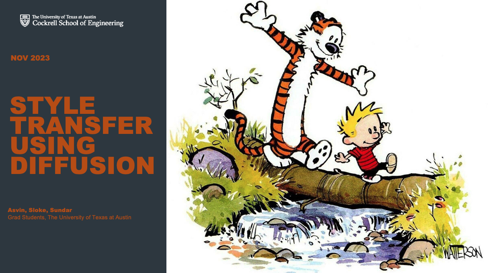
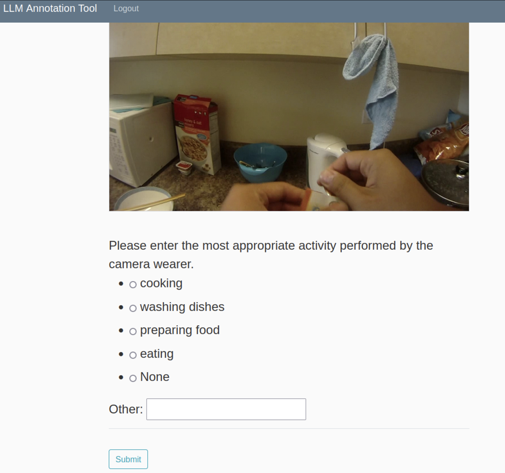
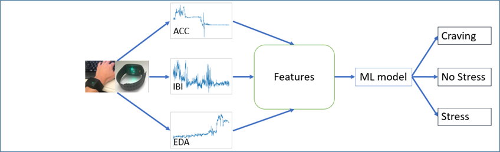
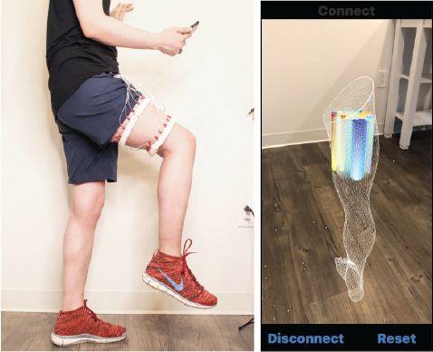
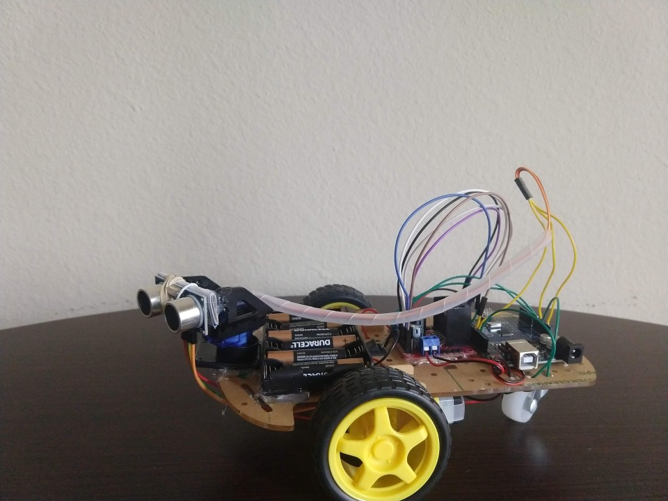
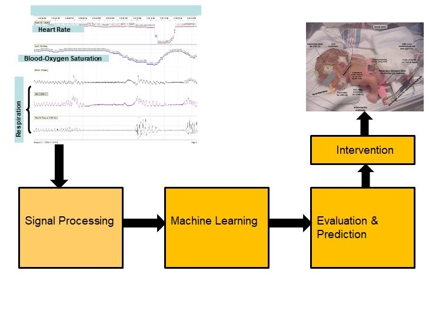

### Style Transfer Using Diffusion
##### 2023

*We fine tuned stable diffusion to a Calvin and Hobbes dataset. We won the EE 371Q Digital Image Processing Ram’s Horn best project award!! EE 371Q is a famous class taught by [Prof. Alan Bovik](https://www.ece.utexas.edu/people/faculty/alan-bovik) at University of Texas at Austin.   

Technology used: Python, HuggingFace, OpenCV, Numpy*

[Repository](https://github.com/slokeshrestha26/dip_comics_diffusion) &nbsp;&nbsp;|&nbsp;&nbsp;
[Video](https://www.youtube.com/watch?v=kMGjOr974vE) &nbsp;&nbsp;|&nbsp;&nbsp;
[Report](http://arxiv.org/abs/2312.03993)

### LLMs Powered Egocentric Image Annotation Web Application
##### 2023

*I developed a web application in Flask where a user can log in, and perform studies. The user gets an egocentric image from a camera wearer. Along with the images, the user also gets a list of possible activities that the camera wearer might be performing. The suggestions are powered by large language models (LLMs). The user can select the activity that best describes the image.

Technology used: Python, Flask, HTML, CSS, JavaScript, Bootstrap, MySQL, HuggingFace, Pandas, Numpy*

### Machine Learning to Detect Cravings and Stress in Patients With Substance Use Disorder   
##### 2019 - 2022

 Image reproduced with permission from CHIA Lab

*I worked with the team at UT Tyler and RAE Health(https://www.raehealth.com) to develop a machine learning algorithm to detect stress and cravings in patients with substance use disorder. We published in three major venues.*

[Article 1](https://www.sciencedirect.com/science/article/pii/S0376871620300946) &nbsp;&nbsp;|&nbsp;&nbsp;
[Article 2](https://jpbs.hapres.com/htmls/JPBS_1370_Detail.html) &nbsp;&nbsp;|&nbsp;&nbsp;
[Article 3](https://www.ncbi.nlm.nih.gov/pmc/articles/PMC9925294/) &nbsp;&nbsp;|&nbsp;&nbsp;
  

### EIT Toolkit 
##### 2021

 Image reproduced with permission from HCIE Lab

*I worked with researchers at MIT to benchmark different image reconstruction algorithms for electrical impedance tomography (EIT). I implemented image reconstruction algorithms in the toolkit called [EIT-KIT](https://github.com/HCIELab/EIT-kit_open-source). Our team submitted a strong rebuttal at UIST and published it.
Technology used: Python, Swift, XCode, Numpy, Pandas*

<!-- 
 In Proceedings of UIST 2021 (to appear)
 -->

### Echolocation Robot 
##### 2020

*At UT Tyler, we (team of 3) built a robot that can avoid obstacles using ultrasonic sound emitter and receiver.
Technology used: Arduino UNO, C*

[Video](https://www.youtube.com/watch?v=5K78zUNMeq8) &nbsp;&nbsp;|&nbsp;&nbsp;
[Repository](https://github.com/slokeshrestha26/echoRobot)  

### Machine Learning Algorithms for the Prediction of Bradycardia Risk in Preterm Infants  

##### 2019 - 2020

 Image reproduced with permission from CHIA Lab

*I worked on developing machine learning based risk stratification algorithm to predict life-threatening events in preterm infants.
Technology used: MATLAB, Python*

I have been working on developing machine learning based risk stratification algorithm for preterm infants.   

<!-- todo : Insert pictures and links -->